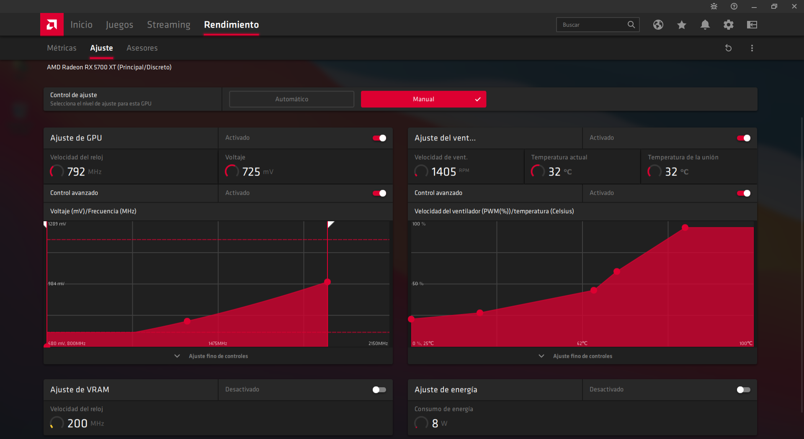

        

Settings valid for **AMD Radeon RX 5700 XT** GPU, with [Adrenalin 2020 Edition v**20.11.2**](https://drivers.amd.com/drivers/radeon-software-adrenalin-2020-20.11.2-win10-64bit-nov18.exe) drivers.

The frequency is limited to 1906Mhz with a maximum voltage of 996mV, the temperature and performance curve of the blower type heatsink is adjusted, objective, better and more stable performance, and reduced temperature and sound of the GPU fan.

## Settings

Load the file **undervolt.xml** from the AMD Radeon panel, in the performance tab, in manual mode and restart. 

Occasionally, the configuration settings are reset, it is up to the software, in that case, reload the file.

### Changelog
- 20.11.2
